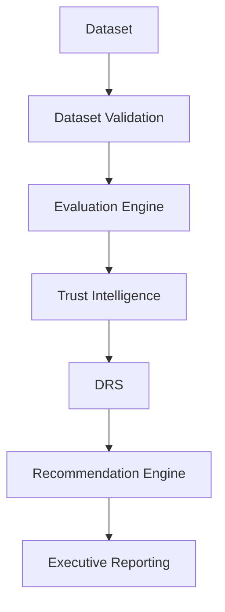

<!-- # OpenVals - The Trust Layer for AI

OpenVals is a modern web application that provides AI validation and security services. The platform helps organizations ensure their AI systems are secure, reliable, and validated before deployment.

## Features

- **AI Red Teaming**: Simulating real-world attacks including prompt injection, jailbreaks, and adversarial inputs
- **Model Validation**: Testing accuracy, hallucinations, bias, and performance under stress conditions
- **AI Security**: Identifying data leakage, model extraction risks, and API vulnerabilities
- **Certification**: Audit-grade validation reports and deployment readiness scoring
- **OpenVals AI Assurance Framework™**: A comprehensive framework for AI validation across four stages:
  - V1: Validation (Accuracy, bias, performance)
  - V2: Vulnerability (Attacks, exploits, leakage)
  - V3: Variability (Drift, instability, edge cases)
  - V4: Verifiability (Audit, reporting, certification)

## Technology Stack

- **Frontend**: Next.js (React framework)
- **Styling**: CSS Modules with a modern, responsive design system
- **Animations**: Framer Motion for smooth, interactive animations
- **Content Management**: Sanity CMS for blog content
- **UI Components**: Custom components with a consistent design language

## Project Structure

```
src/
├── app/                # Next.js app directory
│   ├── page.tsx        # Home page
│   ├── blog/           # Blog section
│   │   ├── page.tsx    # Blog index page
│   │   └── [slug]/     # Dynamic blog post pages
│   │       └── page.tsx
│   └── components/     # Reusable components
│       └── ui.module.css # Global styles
├── sanity/             # Sanity CMS configuration
│   ├── lib/            # Sanity client and utilities
│   │   ├── client.ts   # Sanity client configuration
│   │   └── queries.ts  # Sanity queries
│   └── schemas/        # Sanity schema definitions
└── public/             # Static assets
```

## Getting Started

1. Clone the repository
2. Install dependencies: `npm install`
3. Set up Sanity environment variables
4. Run the development server: `npm run dev`

## Usage

The application features:
- A clean, modern design with smooth animations
- Sections for services, framework, and blog
- Dynamic blog functionality with individual post pages
- Use of Portable Text for rich blog content
- Responsive design that works on all devices -->

# OpenVals

**AI Trust Intelligence Platform for LLMs, SLMs, Private AI, and Enterprise AI Systems**

> **Evaluate • Benchmark • Trust Intelligence**

OpenVals is an enterprise-grade AI evaluation and trust platform designed to help organizations measure, compare, validate, and deploy AI systems with confidence. 

Unlike traditional AI benchmarks that focus only on accuracy, OpenVals evaluates performance, trustworthiness, factuality, reliability, safety, hallucination risk, governance readiness, and deployment confidence.

---

## Why OpenVals?

Most AI models perform well in demonstrations. Production environments require something different:

* **Can the model be trusted?**
* **Is the response factually correct?**
* **How reliable is the model under repeated execution?**
* **What is the hallucination risk?**
* **Is the dataset itself trustworthy?**
* **Is the model ready for enterprise deployment?**

OpenVals was built to answer these questions.

---

## Core Platform Capabilities

### 1. AI Evaluation Engine
Evaluate AI systems using multiple dimensions:
* **Accuracy** — Target correctness and task alignment
* **Semantic Similarity** — Contextual and semantic relevance
* **Reliability** — Generation stability across repeated runs
* **Safety** — Detection of unsafe or harmful content
* **Consistency** — Pattern and tone consistency
* **Variance** — Measurement of output variance across runs
* **Latency** — Performance and generation speed
* **Factuality** — Groundedness and factual alignment
* **Hallucination Risk** — Estimate of hallucinated/unreliable content

### 2. Decision Reliability Score (DRS)
OpenVals introduces the **Decision Reliability Score (DRS)**, a deployment-focused trust metric designed to determine whether an AI system is suitable for real-world production environments.

Traditional leaderboards answer: 
> *"Which model scored highest?"*

DRS answers: 
> *"Which model can be trusted in production?"*

DRS integrates all core metrics (Accuracy, Semantic Intelligence, Reliability, Safety, Consistency, Variance, Latency, Hallucination Risk, Factuality) into a single, actionable score to support business decisions.

### 3. Factuality Engine
OpenVals includes a dedicated factuality scoring engine capable of:
* **Semantic factual alignment**
* **Numeric consistency validation**
* **Contradiction detection**
* **Factual risk classification**

**Outputs:**
* Factuality Score
* Risk Level
* Detailed Issues Detected

### 4. Hallucination Probability Index (HPI)
OpenVals introduces **HPI (Hallucination Probability Index)**, which estimates the probability that a model response contains hallucinated or unreliable content.

**Risk Levels:**
* 🟢 **Low**
* 🟡 **Medium**
* 🟠 **High**
* 🔴 **Critical**

### 5. Dataset Intelligence
*Trust the dataset before trusting the model.*

The Dataset Validation CLI includes:
* Schema validation
* Quality validation
* Duplicate detection
* Missing field detection
* **Dataset Health Score (DHS)**

**CLI Examples:**
```bash
openvals validate-dataset finance
openvals validate-dataset ./customer_dataset.json
openvals validate-dataset ./customer_dataset.csv
```

### 6. Multi-Model Benchmarking
Compare multiple models under identical conditions.

* **Supported:** Ollama Models, Local Models, Private AI, Enterprise AI, and Future API-based providers.
* **Capabilities:** Side-by-side comparison, normalized ranking, DRS ranking, and trust intelligence reporting.

### 7. Parallel Execution Engine
OpenVals supports parallel model execution for faster benchmarking.
```bash
openvals benchmark \
  --dataset finance \
  --models mistral,llama3 \
  --parallel \
  --max-workers 2
```
* **Benefits:** Reduced benchmark runtime, better scalability, and future SaaS readiness.

### 8. Executive Reporting
OpenVals generates executive-grade reports:
* **Dashboard Report (`report.html`):** Includes a Trust Dashboard, DRS Ranking, Operational Insights, Governance Readiness, Risk Analysis, and Visual Analytics.
* **Sample-Level Evaluation Report (`sample_report.html`):** Includes details on Prompt, Expected Output, Model Output, Accuracy, Semantic, Factuality, Hallucination Risk, Safety, and Latency.

---

## Supported Benchmark Domains

### Current Datasets
* Finance
* Healthcare
* Cybersecurity

### Future Datasets
* Legal
* Insurance
* Manufacturing
* Retail
* Enterprise Operations
* Software Engineering

---

## Installation

```bash
pip install openvals
```

---

## Quick Start

### Benchmark multiple models:
```bash
openvals benchmark \
  --dataset finance \
  --models mistral,llama3 \
  --config finance
```

### Validate a dataset:
```bash
openvals validate-dataset finance
```

### List available datasets:
```bash
openvals datasets
```

### Show version:
```bash
openvals version
```

---

## OpenVals Architecture



---

## Roadmap

### v0.4.0 (Current)
- [x] Parallel Model Execution
- [x] Reporting Refactor
- [x] Sample-Level Drilldown
- [x] Dataset Validation CLI
- [x] Judge Layer Foundation

### v0.5.0 (Upcoming)
- [ ] LLM-as-a-Judge
- [ ] Trust Index (TI)
- [ ] Governance Analytics
- [ ] PDF Reports
- [ ] REST APIs
- [ ] Evaluation History
- [ ] Hugging Face Dataset Integration
- [ ] Kaggle Dataset Integration

### Future
- [ ] OpenVals Cloud
- [ ] Enterprise Governance
- [ ] Continuous AI Validation
- [ ] Team Workspaces
- [ ] Trust Intelligence Dashboard
- [ ] AI Certification Framework

---

## Vision
OpenVals is building the **Trust Intelligence Layer for AI**. 
*The future of AI is not determined by which model is largest. The future belongs to AI systems that can be measured, validated, governed, and trusted.*

---

## Contributing
Contributions are welcome.
1. Fork the repository
2. Create a feature branch
3. Submit a pull request

---

## License
Dr.Pinnacle Community Edition License (DPCL-CE) v1.0

---

## Developed By
**DrPinnacle** — AI Trust, Validation & Governance Initiative
