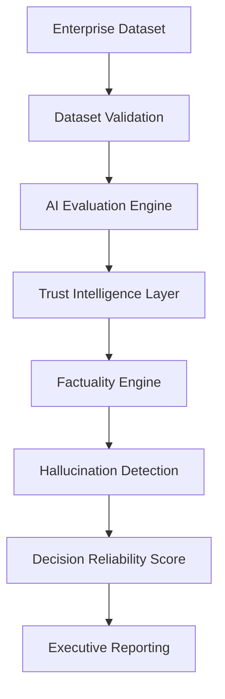

<!-- # OpenVals - The Trust Layer for AI

OpenVals is a modern web application that provides AI validation and security services. The platform helps organizations ensure their AI systems are secure, reliable, and validated before deployment.

## Features

- **AI Red Teaming**: Simulating real-world attacks including prompt injection, jailbreaks, and adversarial inputs
- **Model Validation**: Testing accuracy, hallucinations, bias, and performance under stress conditions
- **AI Security**: Identifying data leakage, model extraction risks, and API vulnerabilities
- **Certification**: Audit-grade validation reports and deployment readiness scoring
- **OpenVals AI Assurance Framework™**: A comprehensive framework for AI validation across four stages:
  - V1: Validation (Accuracy, bias, performance)
  - V2: Vulnerability (Attacks, exploits, leakage)
  - V3: Variability (Drift, instability, edge cases)
  - V4: Verifiability (Audit, reporting, certification)

## Technology Stack

- **Frontend**: Next.js (React framework)
- **Styling**: CSS Modules with a modern, responsive design system
- **Animations**: Framer Motion for smooth, interactive animations
- **Content Management**: Sanity CMS for blog content
- **UI Components**: Custom components with a consistent design language

## Project Structure

```
src/
├── app/                # Next.js app directory
│   ├── page.tsx        # Home page
│   ├── blog/           # Blog section
│   │   ├── page.tsx    # Blog index page
│   │   └── [slug]/     # Dynamic blog post pages
│   │       └── page.tsx
│   └── components/     # Reusable components
│       └── ui.module.css # Global styles
├── sanity/             # Sanity CMS configuration
│   ├── lib/            # Sanity client and utilities
│   │   ├── client.ts   # Sanity client configuration
│   │   └── queries.ts  # Sanity queries
│   └── schemas/        # Sanity schema definitions
└── public/             # Static assets
```

## Getting Started

1. Clone the repository
2. Install dependencies: `npm install`
3. Set up Sanity environment variables
4. Run the development server: `npm run dev`

## Usage

The application features:
- A clean, modern design with smooth animations
- Sections for services, framework, and blog
- Dynamic blog functionality with individual post pages
- Use of Portable Text for rich blog content
- Responsive design that works on all devices -->

# OpenVals

**AI Trust Intelligence Platform for LLMs, SLMs, Private AI, and Enterprise AI Systems**

> **Evaluate • Benchmark • Trust Intelligence**

OpenVals is an enterprise-grade AI evaluation and trust platform designed to help organizations measure, compare, validate, and deploy AI systems with confidence.

Unlike traditional AI benchmarks that focus only on accuracy, OpenVals evaluates performance, trustworthiness, factuality, reliability, safety, hallucination risk, governance readiness, and deployment confidence.

[](https://pypi.org/project/openvals/)
[](https://pypi.org/project/openvals/)
[](https://github.com/vishwanathakuthota/openvals/blob/main/LICENSE)
[](https://pypi.org/project/openvals/)
[](https://github.com/vishwanathakuthota/openvals/stargazers)

---

## Trust Infrastructure for AI

### What is OpenVals?
OpenVals is an AI Trust Intelligence Platform that helps enterprises evaluate, validate, benchmark, and govern AI systems before production deployment.

OpenVals answers one question:
> **Can you trust your AI?**

---

## Why OpenVals?

Most AI models perform well in demonstrations. Production environments require something different:
* Can the model be trusted?
* Is the response factually correct?
* How reliable is the model under repeated execution?
* What is the hallucination risk?
* Is the dataset itself trustworthy?
* Is the model ready for enterprise deployment?

OpenVals was built to answer these questions.

### Platform Comparison

| Capability | Traditional Benchmarking | OpenVals |
| :--- | :---: | :---: |
| Accuracy | ✓ | ✓ |
| Latency | ✓ | ✓ |
| Semantic Similarity | ✓ | ✓ |
| Hallucination Detection | Limited | ✓ |
| Factuality Analysis | Limited | ✓ |
| Trust Scoring | ✗ | ✓ |
| Governance Readiness | ✗ | ✓ |
| Executive Reporting | ✗ | ✓ |
| Enterprise Validation | ✗ | ✓ |

### Enterprise Use Cases

* **AI Model Selection** — Compare GPT, Claude, Llama, Mistral, and private models before deployment.
* **Private AI Validation** — Validate enterprise AI running on Ollama, vLLM, or self-hosted infrastructure.
* **AI Procurement** — Benchmark vendor AI solutions before purchasing decisions.
* **AI Governance** — Measure AI readiness against organizational trust and governance requirements.
* **AI Red Teaming Foundation** — Identify hallucination risk, factual weaknesses, and trust gaps.
* **Executive Reporting** — Generate trust dashboards and executive-level AI readiness reports.

---

## Core Platform Capabilities

### 1. AI Evaluation Engine
Evaluate AI systems using multiple dimensions:
* Accuracy
* Semantic Similarity
* Reliability
* Safety
* Consistency
* Variance
* Latency
* Factuality
* Hallucination Risk

### 2. Decision Reliability Score (DRS)
OpenVals introduces the **Decision Reliability Score (DRS)**, a deployment-focused trust metric designed to determine whether an AI system is suitable for real-world production environments.

Traditional leaderboards answer:
> *"Which model scored highest?"*

DRS answers:
> *"Which model can be trusted in production?"*

DRS integrates all core metrics (Accuracy, Semantic Intelligence, Reliability, Safety, Consistency, Variance, Latency, Hallucination Risk, Factuality) into a single, actionable score to support business decisions.

### 3. Factuality Engine
OpenVals includes a dedicated factuality scoring engine capable of:
* Semantic factual alignment
* Numeric consistency validation
* Contradiction detection
* Factual risk classification

**Outputs:**
* Factuality Score
* Risk Level
* Issues Detected

### 4. Hallucination Probability Index (HPI)
OpenVals introduces **HPI (Hallucination Probability Index)**, which estimates the probability that a model response contains hallucinated or unreliable content.

**Risk Levels:**
* 🟢 **Low** — High confidence, reliable response suitable for automated deployment.
* 🟡 **Medium** — Moderate confidence, potential minor inconsistency. Review recommended for high-stakes tasks.
* 🟠 **High** — Low confidence, probable hallucination. Avoid direct deployment.
* 🔴 **Critical** — Confirmed hallucination or highly contradictory content. Response should be blocked.

### 5. Dataset Intelligence
*Trust the dataset before trusting the model.*

The Dataset Validation CLI includes:
* Schema validation
* Quality validation
* Duplicate detection
* Missing field detection
* **Dataset Health Score (DHS)**

---

## 60-Second Quick Start

### Install
```bash
pip install openvals
```

### Benchmark
Evaluate and compare models on a specific dataset:
```bash
openvals benchmark \
  --dataset finance \
  --models mistral,llama3
```

#### Expected CLI Output
```
Model      Accuracy    DRS
--------------------------------
llama3     91.4        89.2
mistral    87.8        82.4
QWEN       70.7        69.7
```

### Validate Dataset Examples
```bash
openvals validate-dataset finance
openvals validate-dataset ./customer_dataset.json
openvals validate-dataset ./customer_dataset.csv
```

### Benchmark Multiple Models with Config
```bash
openvals benchmark \
  --dataset finance \
  --models mistral,llama3 \
  --config finance
```

### Parallel Execution Engine
OpenVals supports parallel model execution for faster benchmarking.
```bash
openvals benchmark \
  --dataset finance \
  --models mistral,llama3 \
  --parallel \
  --max-workers 2
```
* **Benefits:** Reduced benchmark runtime, better scalability, and future SaaS readiness.

### Show Version
```bash
openvals version
```

---

## Example Output
Below is an example of the detailed Trust Intelligence Report generated by the CLI:

```
===================================================
OpenVals Trust Intelligence Report
===================================================

Model: llama3

Accuracy Score      : 91.4
Semantic Score      : 89.1
Factuality Score    : 92.3
Safety Score        : 95.2
Latency Score       : 83.0

Hallucination Risk  : LOW

Decision Reliability Score (DRS)

89.2 / 100

Deployment Status:

READY FOR PRODUCTION
```

---

## Screenshots

### Trust Dashboard
Reconstruction of the multi-model executive dashboard tracking recommended models, DRS, and sub-score category sparklines.

### Sample Evaluation Report
Detailed sample-level metrics showing prompts, model completions, and HPI flags.

### Dataset Validation
Interactive dataset health analytics and schema checking logs.

### Multi-Model Benchmarking
Compare and rank multiple models under identical conditions:
* **Supported:** Ollama Models, Local Models, Private AI, Enterprise AI, and Future API-based providers.
* **Capabilities:** Side-by-side comparison, normalized ranking, DRS ranking, and trust intelligence reporting.

---

## Supported Benchmark Domains

### Current Datasets
* Finance
* Healthcare
* Cybersecurity
* Legal

### Coming Soon
* Insurance
* Manufacturing
* Retail

### Enterprise Operations
* Software Engineering
* Math
* Reasoning

---

## OpenVals Architecture



---

## OpenVals Ecosystem
OpenVals is part of a larger AI Trust & Assurance ecosystem:
* **OpenVals** — AI Validation & Trust Intelligence
* **AI Compass** — AI Maturity & Readiness Assessment
* **DrPinnacle** — AI Strategy, Governance & Advisory
* **OpenVals Cloud (Coming Soon)** — Continuous AI Validation Platform

---

## Vision
OpenVals is building the **Trust Intelligence Layer for AI**.
*The future of AI is not determined by which model is largest. The future belongs to AI systems that can be measured, validated, governed, and trusted.*

### Evaluation vs Validation
Most platforms evaluate AI. OpenVals validates trust.

* **Evaluation answers:** *"How well does the model perform?"*
* **Validation answers:** *"Can the model be trusted in production?"*

OpenVals was built around this distinction.

---

## Contributing
Contributions are welcome.
1. Fork the repository
2. Create a feature branch
3. Submit a pull request

---

## License
Dr.Pinnacle Community Edition License (DPCL-CE) v1.0

---

## Developed By
**DrPinnacle** — AI Trust, Validation & Governance Initiative
